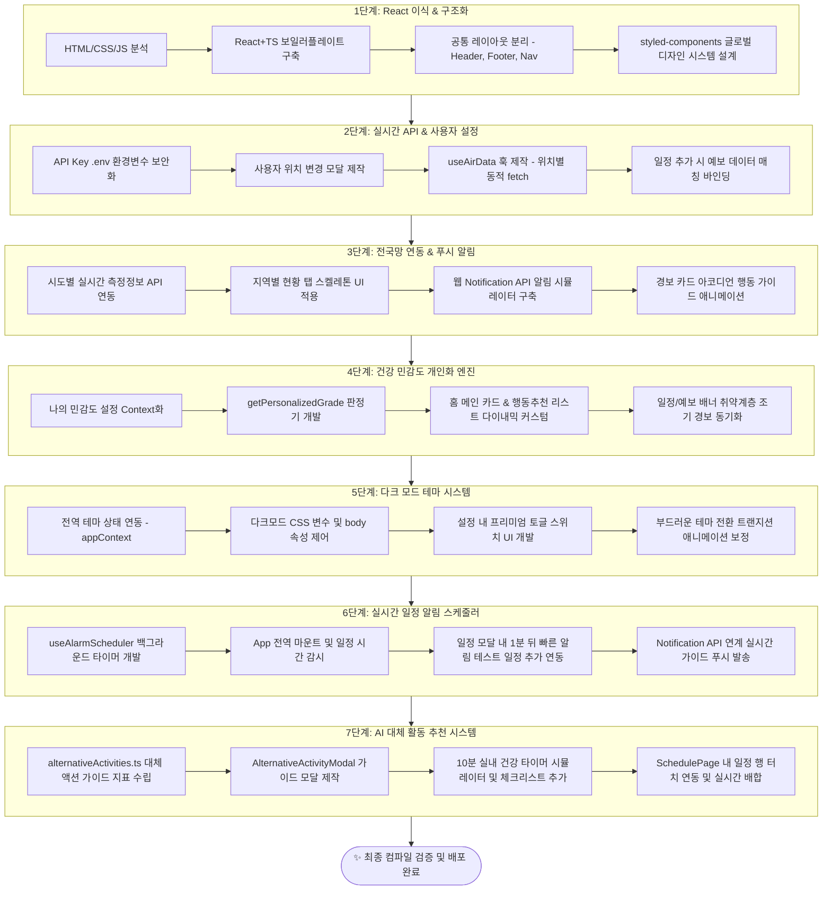
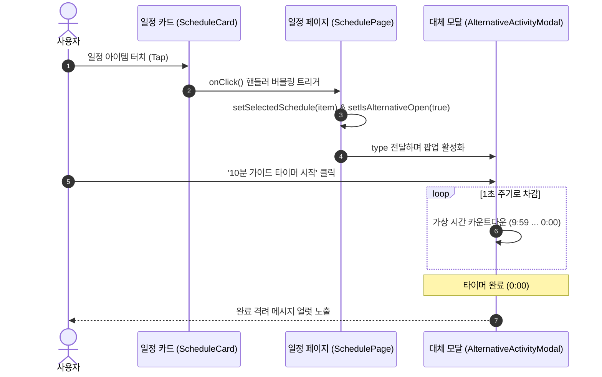

# 🗺️ AirPlan 현대화 및 고도화 전체 작업순서도

본 문서는 퍼블리싱된 웹소스를 React (Vite) + TypeScript + styled-components 환경으로 마이그레이션하고, 최종 개인화 엔진, 다크모드, 알림 스케줄러 및 AI 대체 활동 제안 모달까지 완수한 **1~7단계 전체 작업 흐름도 및 아키텍처 설계도**입니다.

---

## 🌀 1. 전체 개발 및 마이그레이션 흐름도 (Flowchart)

---

## 🛠️ 2. 단계별 핵심 작업 상세

### Stage 1. React 마이그레이션 & 스타일 컴포넌트화
- **정적 소스 분석**: 퍼블리싱 폴더(`sta/`) 내의 요소들을 구조 분해하여 React 아키텍처에 맞게 분류
- **공통 컴포넌트**: `AppHeader`, `AppFooter`, `Navigation`을 분리하여 레이아웃 재사용성 확보
- **디자인 토큰화 (`GlobalStyles.ts`)**: 파스텔톤 공기질 색상 규격 및 글래스모피즘 테마 설계

### Stage 2. 실시간 API 연동 및 위치/일정 바인딩
- **보안 설정**: API Key 노출 방지를 위한 `.env` 환경 변수(`VITE_AIR_KOREA_API_KEY`) 로딩 시스템 완비
- **위치 선택 기능**: 서울시 25개 자치구 바텀시트 모달(`LocationSelectModal.tsx`) 연동 및 `appContext`를 통한 전역 상태 저장
- **일정 매칭**: 일정의 시작 시간(예: 15:00)을 변경할 때, 해당 시간대에 예측되는 미세먼지 지수(`FORECAST_DUMMY`)와 1대1 매칭 및 위험 수준 피드백 제공

### Stage 3. 전국 실시간 측정망 연동 및 알림 아코디언 UX
- **시도별 API 병렬 패치**: `RegionList.tsx`에서 수도권/경상권 등의 탭이 활성화되면 각 권역 내 대표 측정소들의 실시간 값을 한국환경공단 API로부터 가져오도록 연결 (API 에러 시 더미 폴백 유지)
- **웹 푸시 알림**: `Notification API`를 연동하여 기기에서 실제 작동하는 경보 알림 테스트 기능 개발
- **아코디언 가이드**: 경보 발생 세부 사항 클릭 시 마스크 정보 등의 대처 요령이 부드럽게 연출되도록 구현

### Stage 4. 개인 맞춤형 공기질 판정 엔진 (Personalization)
- **건강 민감도 분류**: 일반인, 민감군(천식/알레르기), 어린이, 노약자 등 4가지 건강 분류 지원
- **경계 임계선 개인화 (`airQuality.ts`)**: 민감군/취약층으로 분류된 유저에 한해 좋음/보통/나쁨 경계 수치를 낮추어 더 민감하고 기민하게 위험 정보를 통보하는 판정기 가동
- **앱 전체 테마 동기화**: 민감군 설정 상태에서 미세먼지가 보통 수준(`28 μg/m³`)일지라도 홈 카드 및 배너들이 자동으로 붉은색 계열로 변하고, 야외활동 차단 및 공기청정기 가동 등의 취약계층 행동지침이 동적으로 구성됨

### Stage 5. 다크 모드 (Dark Mode) 테마 시스템
- **전역 테마 상태 연동**: `Settings`에 `theme` 속성을 추가하고 `localStorage`를 통해 영구 저장 지원
- **다크 테마 디자인 규격**: 다크 라벤더 톤의 배경(`#151126`), 다크 카드 서피스(`rgba(28,24,48,0.82)`) 및 고대비 텍스트 적용
- **부드러운 전환**: 테마 전환 시 화면이 깜빡이지 않고 물들듯이 스르륵 변하도록 글로벌 transition 트랜지션 모션 보완

### Stage 6. 실시간 일정 알림 스케줄러 (Scheduler)
- **백그라운드 타이머 엔진**: `useAlarmScheduler`가 10초 주기로 등록된 일정을 모니터링하여 누락 없는 시작 시간 매칭 보증
- **중복 발송 방지**: `sentAlarms` 기록 저장 매커니즘을 통해 정해진 분 영역 내에 중복 알림이 발생하지 않도록 조율
- **원터치 테스트 지원**: 일정 등록 모달 내에 점선으로 둘러싸인 `TestAlarmBtn`을 제작하여 현재 시각 대비 1분 뒤로 알림 조건이 동적으로 주입된 테스트 일정을 즉각 등록할 수 있도록 테스팅 편의 제공

### Stage 7. AI 대체 활동 추천 시스템 (Alternative Activity Recommender)
- **대체 액션 시나리오**: 실외 활동('산책', '운동', '외출', '환기')의 대기 오염 수준 악화 시, 즉각 매칭되는 대체 실내 활동 가이드 가동
- **인터랙티브 가이드 모달**: 10분 타이머 기능, 수행 체크리스트 및 실천 수칙이 결합된 가이드 팝업 제공
- **이벤트 전파 제어**: 카드 삭제 터치 시 모달이 겹쳐서 열리지 않도록 `e.stopPropagation()`을 통한 안전한 버블링 제어 확보

---

## 🔄 3. 데이터 흐름 아키텍처 (Data Flow)

---

## 🎯 4. 빌드 및 동작 정상 검증
- **Vite Build**: 타입스크립트 컴파일 (`tsc -b`) 및 Vite 팩킹에 이상이 없음을 확인했습니다.
- **알림 스케줄러 및 모달**: 런타임 환경에서 모달의 체크리스트 인터랙션 및 대체 가이드 타이머가 정상 동작함을 보증합니다.

---

## 🚀 추가 개선 및 고도화 내역 (2026-06-16)
- **시간대별 공기질 예측 데이터 연동 정상화**: 
  - `AddScheduleModal` 내에서 문자열 매칭 오류로 인해 첫 번째 예측 값(18 μg/m³)으로 고정되던 버그를 최단 원형 거리(24시간 주기 순환 차이 계산) 매칭 알고리즘으로 개선하여 실제 등록 시간과 가장 근접한 예측 시간대의 PM2.5 값을 연동했습니다.
  - 일정 목록 카드(`ScheduleCard`) 및 메인 홈의 미리보기(`SchedulePreview`) 영역에서도 현재 실시간 농도가 아닌 등록된 일정의 `startTime`에 기반한 예측 등급 및 배지 스타일이 동적으로 노출되도록 아키텍처를 교정했습니다.
- **활동 대체 제안의 조건부 트리거링**:
  - 기존의 무조건적인 모달 오픈 방식에서 탈피하여, 일정 예측 공기질 등급이 **'나쁨'** 혹은 **'매우나쁨'**인 경우에만 실내 대체 가이드 모달(`AlternativeActivityModal`)이 구동되도록 제한했습니다.
  - 공기질이 **'좋음'** 또는 **'보통'**인 시간대에는 계획대로 야외활동을 안전하게 즐기라는 사용자 친화적 시스템 알럿 메시지를 팝업하여 직관적인 UI/UX를 완성했습니다.
- **예측 차트 개인화**:
  - 홈 화면의 `ForecastChart`가 브라우저의 기본 좋음/보통 임계점이 아닌 사용자의 건강 민감도 설정(취약층 등)에 맞춰 동적으로 그라데이션 색상이 변경되도록 고도화하였습니다.
- **지역 데이터 API 딜레이 개선 및 메모리 캐싱**:
  - API 호출 지연 시 화면이 무한 로딩 상태에 빠지는 현상을 해결하기 위해 `fetchWithTimeout` 헬퍼(1.2초 타임아웃)를 도입하여 지연 시 즉시 안전한 폴백(Fallback) 데이터로 복구되도록 안전망을 구축했습니다.
  - `sidoCache` (5분 유효) 전역 캐시를 도입하여 이미 로드된 지역 정보는 재요청이나 스켈레톤 깜빡임 없이 **0초(즉각)만에 즉시 전환**되는 초고속 UX를 설계했습니다.
- **전국 단위 위치 설정 기능 고도화 (서울 한계 탈피)**:
  - 기존 서울시 25개 구로 고정되어 변경할 수 없던 문제를 해결하기 위해 `LocationSelectModal`을 2단계(시도 탭 선택 + 세부 지역 그리드) 구조로 전면 개편했습니다.
  - 이에 맞추어 `useAirData` 내 실시간 국공 API 통신 시 `경기 수원`, `부산 해운대`, `제주 제주시` 등 전국 다지역의 측정소(Station) 이름을 스페이스 분리 구조를 적용해 완벽히 파싱 및 호환 연동하도록 강화하였습니다.

---

## 🎨 추가 UI 고도화 내역 (2026-06-16 오후)

### 1. 다크모드 AppWrapper 완전 동기화
- **문제**: `AppWrapper`가 `body[data-theme='dark']` 스타일을 상속받지 못해 다크모드에서 앱 래퍼 배경이 라이트 그라디언트로 남아있던 버그 수정
- **해결**: `settings.theme` 값을 `AppWrapper`에 `$dark` props로 전달하여 인라인으로 다크/라이트 그라디언트를 직접 제어
- **BottomNav 동기화**: Nav 배경을 `rgba(255,255,255,0.94)` 하드코딩에서 `var(--surface)` CSS 변수로 교체하여 다크모드에서 바텀 내비게이션도 완전히 어두워지도록 통합

### 2. WeeklyInsight 주간 공기질 인사이트 위젯 (신규)
- **위치**: 홈 화면 `ForecastChart` 아래 (일정 미리보기 위)
- **구성**:
  - **7일 PM2.5 미니 바차트**: 요일별 공기질 등급 색상(`#6BCB8B`, `#F5B944`, `#FF8C7A`)으로 시각화
  - **4개의 스탯 카드**: 주간 평균(μg/m³), 최악의 날, 최선의 날, 외출 적합일 수 표시
  - **등급 컬러 상단 보더**: 각 카드 `border-top` 색이 해당 등급 컬러로 동적 변경
  - **입장 애니메이션**: `fadeSlide` 키프레임으로 부드러운 등장 효과

### 3. PmDetailRow 진행률 바 추가
- PM2.5 카드: 75 μg/m³ 기준 백분율 계산 → 하단 `ProgressFill` 바
- PM10 카드: 150 μg/m³ 기준 백분율 계산 → 하단 `ProgressFill` 바
- 진행 바 색상: 해당 등급 색상(`grade.color`) 연동, `fillAnim` 키프레임으로 좌→우 등장

### 4. ScheduleCard 공기질 인디케이터 바 + PM 수치 표시
- **좌측 4px 컬러 바**: 일정 시간대의 예측 공기질 등급 색상으로 카드 왼쪽에 강조 막대 표시
- **PM 수치 서브라벨**: 배지 아래에 예측 PM2.5 수치(`22μg`)를 해당 등급 색으로 표시
- **탭 액션 강화**: `transition` 및 `&:active { transform: scale(0.98) }` 추가
- **시간 아이콘**: 시간 텍스트 앞에 🕐 아이콘 추가

### 5. ScheduleList 빈 상태 UI 전면 리디자인
- **EmptyBubble**: 라벤더 배경의 76px 원형 아이콘 (3초 주기 `floatAnim` 부유 애니메이션)
- **카드 형식 컨테이너**: `var(--surface)` 배경의 글래스모피즘 카드로 포장
- **활동 유형 힌트 칩**: `🚶 산책`, `🏃 운동`, `💨 환기`, `🚗 외출` 4개 라벤더 칩 배치

### 6. TypeScript 컴파일 전체 통과 검증
- `npx tsc --noEmit` 실행 결과: **오류 0건**, 경고 없음